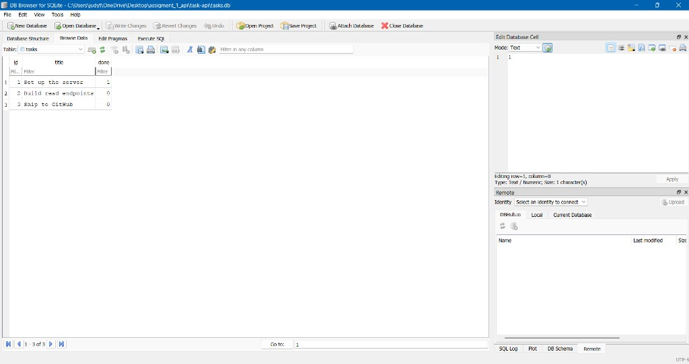

# FlyRank Task API (SQLite → Postgres)

## Overview
A backend REST API for managing tasks. Storage moved from an in-memory array (A1) to SQLite (A2), and now toward a containerized PostgreSQL database (A3). Endpoints and response shapes stay the same — only the storage layer changes.

## Why SQLite? (A2)
SQLite is a single file on disk with zero setup: no separate database server to install or run. Opening `tasks.db` creates the file if it is missing. That makes it a good fit for local work — data persists across restarts, and anyone who clones the repo gets a working database on first run without extra config.

## Tech Stack
* **Runtime:** Node.js
* **Framework:** Express.js
* **Database (A2):** SQLite (`better-sqlite3`)
* **Database (A3):** PostgreSQL in Docker (`pg` + Docker Compose)

## Where the database lives
* **A2:** File `task-api/tasks.db` (git-ignored; created on first run)
* **A3:** Postgres service `db` in Docker Compose; data in named volume `taskdata`

## Run the whole stack (A3 Stage 4) — one command
From the `task-api` folder, with Docker Desktop running:

```bash
docker compose up --build
```

This starts:
* **api** — your Express app on http://localhost:3000
* **db** — Postgres on port 5432 (reachable from the app as host `db`)

Copy `.env.example` to `.env` for local (non-compose) runs. Inside Compose, `DATABASE_URL` is set in `compose.yaml` and points at `db`, not `localhost`.

Stop everything: `docker compose down`  
Data survives `down`/`up` because of the `taskdata` volume.

## Run Postgres alone (A3 Stage 0)
With Docker Desktop running:

```bash
docker run --name taskdb -e POSTGRES_PASSWORD=dev -e POSTGRES_DB=tasks -p 5432:5432 -v taskdata:/var/lib/postgresql/data -d postgres:16
```

(`postgres:16` is used so the volume path in the assignment works; newer `postgres:latest` changed how data directories are laid out.)

Check it:

```bash
docker ps
docker exec -it taskdb psql -U postgres -d tasks
```

Inside `psql`, `\dt` lists tables (none yet in Stage 0), then `\q` to quit.

**Note:** stop `taskdb` before `docker compose up` so port 5432 is free (`docker stop taskdb`).

## Run the API locally against SQLite (A2)
From the `task-api` folder:

```bash
npm install
node server.js
```

Then open:
* API: http://localhost:3000/tasks
* Docs: http://localhost:3000/docs

## Endpoints
| Method | Path | Description |
|--------|------|-------------|
| GET | `/tasks` | List all tasks |
| GET | `/tasks/:id` | Get one task (404 if missing) |
| POST | `/tasks` | Create a task (`title` required) → 201 |
| PUT | `/tasks/:id` | Update title and/or done |
| DELETE | `/tasks/:id` | Delete a task → 204 |

## Example SQL (A2 Stage 4)
Run in DB Browser for SQLite → Execute SQL:

```sql
SELECT * FROM tasks WHERE done = 1;
```

This returns only completed tasks (`done = 1`). After changing rows in DB Browser, `GET /tasks` shows the same data — API and DB Browser share one file.

## DB Browser screenshot
The `tasks` table in DB Browser for SQLite (three seeded rows after a fresh start):


